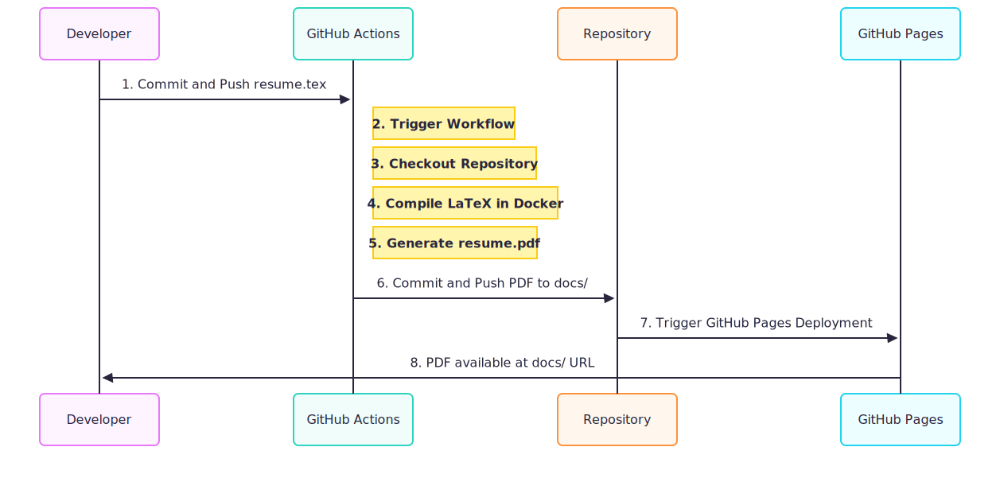

# LaTeX Resume Builder 📄

[](https://github.com/EchoSingh/resume-builder/actions/workflows/compile.yml) [](https://echosingh.github.io/resume-builder/resume.pdf)


A robust, automated solution for creating and maintaining a professional resume using LaTeX, Docker, and GitHub Actions. This project provides a streamlined workflow for generating a high-quality PDF from a `.tex` source, ensuring consistency and simplifying version control.

## Workflow

The following sequence-diagram illustrates the automated build process:



## Project Structure

The repository is organized as follows:

```
resume-builder/
├── .github/
│   └── workflows/
│       └── compile.yml   # GitHub Actions workflow for automated builds
├── data/
│   └── resume.tex        # The main LaTeX source file for the resume
├── docs/
│   └── resume.pdf        # The generated PDF output
├── Dockerfile            # Defines the containerized build environment
├── action.yml            # Defines the custom GitHub Action
└── README.md             # This file
```

## Usage

### Automated Workflow (Recommended)

1.  **Edit `data/resume.tex`** with your information.
2.  **Commit and push** your changes to the `main` branch.
3.  GitHub Actions will automatically:
    -   Compile the LaTeX source file.
    -   Commit the updated `resume.pdf` to the `docs/` directory.

### Local Compilation

#### Prerequisites

-   [Docker](https://www.docker.com/get-started) for the containerized build.
-   A local [LaTeX distribution](https://www.latex-project.org/get/) (e.g., TeX Live, MiKTeX) for manual compilation.

#### Using Docker

This method uses the containerized environment for a consistent build.

```sh
# Build the Docker image
docker build -t resume-builder .

# Run the container, mounting the current directory
# The generated PDF will be in the `docs/` folder
docker run --rm -v "$(pwd):/github/workspace" resume-builder
```

#### Manual Compilation

If you have a local LaTeX installation, you can compile the resume directly.

```sh
# Compile the .tex file and place the output in the docs/ directory
pdflatex -output-directory=docs data/resume.tex
```

## Contributing

Contributions are welcome! If you have suggestions for improvements, please open an issue or submit a pull request.

## License

This project is licensed under the MIT License. See the [LICENSE](LICENSE) file for details.
